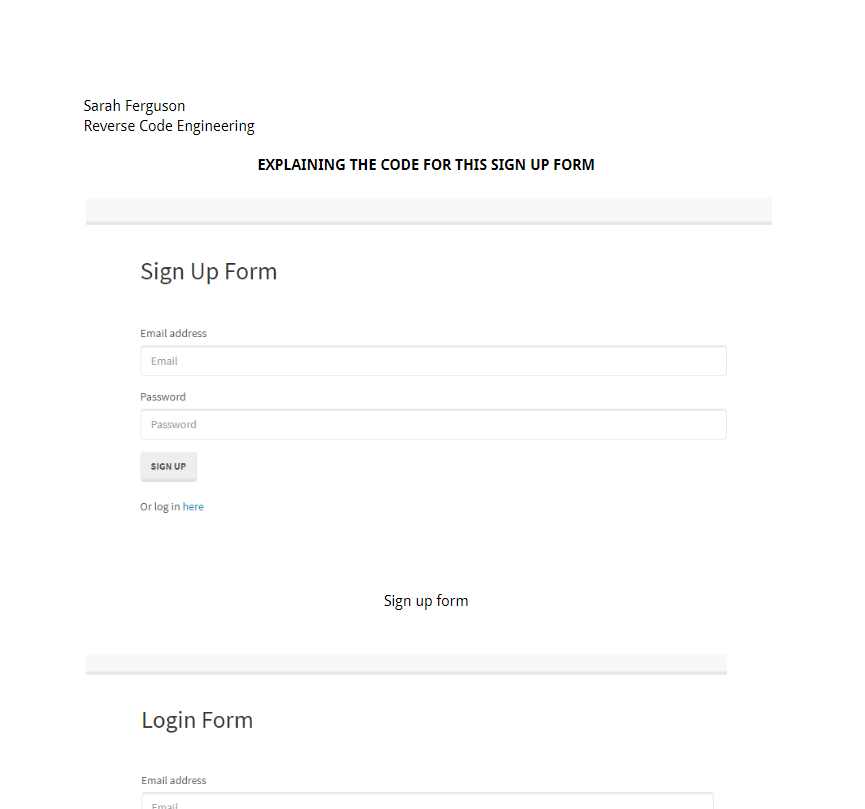

# Code Reverse Engineer

  ## Description: 
  
When joining a new team, you will be expected to inspect a lot of code that you have never seen before. Rather than having a team member explain every line for you, you will dissect the code by yourself, saving any questions for a member of your team.
  
  
  ## Table of Contents 
  
  * [Installation](#installation) 
  * [Usage](#usage)
  * [License](#license)
  * [Contribution](#contributions)
  * [Tests](#tests)
  * [Questions](#questions)

  
  
## Installation
  
You can install the origin code base by npm installing the modules and connecting to your computers local host through the server.js file. 
  
  
## Usage 
  
The Google Doc is located at : https://docs.google.com/document/d/1lDkJuiz3UphrGFqJj_C4L6LQWrDOlvM_X5Cv3L_P23g/edit
  
  
 ## License
  
This project is licensed under none.
  

## Contributions
  
No contributions
  
## Screenshots

 
 ## Questions

 If you have any questions email me at sarahlferguson07@gmail.com
  
 My Github account is https://github.com/saarahah
  
  
  ---
  © 2020